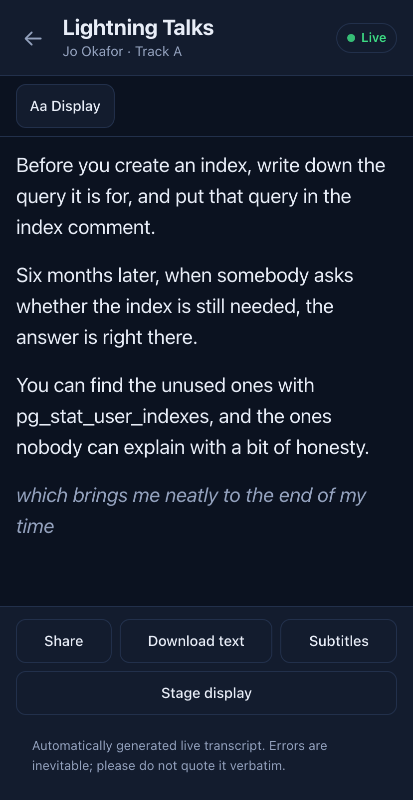

# Slonik Ears

[](https://github.com/dpage/slonik-ears/actions/workflows/ci.yml)
[](https://github.com/dpage/slonik-ears/actions/workflows/docker.yml)
[](https://dpage.github.io/slonik-ears/)

Live transcription for events. A listener sits in each room, hears the talk,
has it transcribed by a Whisper model, and streams the text to a server that
fans it out to anybody watching — on their own phone, or on a screen beside
the stage.

It is built for the conference case: several rooms at once, an audience on a
venue network that blocks devices from talking to each other, and nobody with
the time to debug a Python environment ten minutes before the keynote. The
whole thing is two Go binaries and a static web app.


Only text crosses the network. Audio never leaves the room.

```
   Room A                          Server                      Audience
 ┌──────────────────┐         ┌──────────────────┐         ┌────────────────┐
 │ ears-listener    │         │ ears-server      │         │ phone, laptop  │
 │  mic ─▶ VAD ─▶   │  text   │  rooms, history  │  text   │ stage screen   │
 │  whisper.cpp ────┼────────▶│  fan-out, web    ├────────▶│ /r/main-hall   │
 └──────────────────┘   WSS   └──────────────────┘   WSS   └────────────────┘
   Room B ──────────────────────────▲
   Room C ──────────────────────────┘        Run the server on the same laptop
                                             for one room, or on a cloud box
                                             when the venue's Wi-Fi isolates
                                             clients — which it usually does.
```

## Try it in two minutes

No model, no microphone, no patience required:

```bash
make demo
```

That builds the server, starts it on <http://localhost:8080>, and runs a
listener with a fake transcriber against a sample recording. Open the page,
click into the demo room, and try the stage display. The
[Quick Start](docs/quick_start.md) walks through the same thing in more detail,
and then through a first run with a real model.

## What the audience sees

The lobby lists every room, with the live ones first, so an attendee who
scanned a QR code in the corridor can find the talk they are actually in:


Tapping a room gives the transcript, with the reader in charge of text size,
theme and timestamps. Committed text is regrouped into sentences; the last,
unconfirmed line is shown in a lighter style so a guess is never mistaken for
a quote:


The same page on a phone, which is where most of the audience will read it:



## What the organisers see

Setting `EARS_ADMIN_TOKEN` switches on `/admin`, where a room can be renamed,
retitled, reset between talks, or removed:


Resetting archives the transcript of the talk that has just finished and hands
every viewer a clean page, which is covered in
[Managing Rooms](docs/rooms.md).

## Running it for real

The short version is three processes: a Whisper model server, the relay, and
one listener per room. On a Mac:

```bash
brew install go node whisper-cpp
make build
make model MODEL=large-v3
```

Then start `whisper-server`, `ears-server` and `ears-listener`, in that order.
For the relay on a cloud instance there is a published container image,
`ghcr.io/dpage/slonik-ears`, covered in
[Running in a Container](docs/containers.md).
The [Event Checklist](docs/running_an_event.md) is the full walkthrough,
including what to do the week before, and the
[Choosing a Model](docs/models.md) page has measured accuracy and speed
figures for deciding which model your machine can keep up with.

Two things reliably cost transcripts, both silent failures: microphone
permission on macOS belongs to whichever application runs the binary, and a
sleeping Mac stops transcribing. [Capturing Audio](docs/audio.md) covers both,
along with taking a feed from the mixing desk rather than trusting a laptop
microphone.

### Platforms

| | Runs on | Notes |
| --- | --- | --- |
| `ears-server` | Linux, macOS, Windows; amd64 and arm64 | pure Go, no cgo, no dependencies. Cross-compile it for a cloud box with `make dist`. |
| `ears-listener` | macOS, Linux, Windows | needs cgo for audio capture: CoreAudio on macOS, ALSA/PulseAudio/JACK on Linux, WASAPI on Windows |

The listener is written with a Mac in each room in mind, but nothing about it
is macOS-only. The server is happiest on a small Linux instance well away from
the venue's network; the relay carries only text, so one viewer costs about
0.6 MB per hour and the smallest instance any provider sells is ample.

## Documentation

The documentation is published at
[dpage.github.io/slonik-ears](https://dpage.github.io/slonik-ears/), built
from `docs/` with [MkDocs](https://www.mkdocs.org/) and the Material theme. To
read it locally:

```bash
pip install -r requirements-docs.txt
mkdocs serve
```

The individual pages are readable as plain Markdown without building anything:

| Page | Covers |
| --- | --- |
| [Introduction](docs/index.md) | What the system is for, and what it does not do |
| [Architecture](docs/architecture.md) | How the pieces fit together and where the audio stops |
| [Quick Start](docs/quick_start.md) | Seeing it work with no model and no microphone |
| [Event Checklist](docs/running_an_event.md) | Planning, the day before, and the day itself |
| [Installing](docs/installing.md) | Prerequisites, building, and platform differences |
| [Choosing a Model](docs/models.md) | Measured accuracy and speed on different machines |
| [Capturing Audio](docs/audio.md) | Devices, channels, levels and permissions |
| [Running the Server](docs/server.md) | Tokens, persistence and where to run the relay |
| [Running in a Container](docs/containers.md) | The published image, its configuration and its storage |
| [Running a Listener](docs/listener.md) | Starting a room and describing it |
| [Managing Rooms](docs/rooms.md) | Turning a room around between talks |
| [Listener Options](docs/listener_reference.md) | Every listener flag and configuration key |
| [Server Options](docs/server_reference.md) | Every server flag and configuration key |
| [HTTP API](docs/api.md) | Endpoints, authentication and examples |
| [Tuning Transcription](docs/tuning.md) | Voice detection and utterance segmentation |
| [Troubleshooting](docs/troubleshooting.md) | Symptoms, causes and what to do |
| [Accessibility](docs/accessibility.md) | What the views provide, and the limits |
| [FAQ](docs/faq.md) | The questions that come up first |
| [Developer Resources](docs/developers.md) | Layout, checks and building the docs |

## Development

```bash
make test      # Go tests
make race      # the same, under the race detector
make lint      # gofmt, go vet, golangci-lint, and the web app's type check
make vuln      # govulncheck and npm audit
make smoke     # drive the attendee views in a real browser
cd web && npm run dev    # the web app with hot reload, proxying to :8080
```

`make lint`, `make vuln` and `make smoke` run what CI runs, so a green local
run means a green pull request. The server builds without cgo; the listener
needs it for audio capture, which `make listener` handles.
[Developer Resources](docs/developers.md) covers the package layout, the CI
workflows and how releases are cut.

## Licence

The [PostgreSQL Licence](LICENSE) (SPDX: `PostgreSQL`), same as Postgres
itself.
